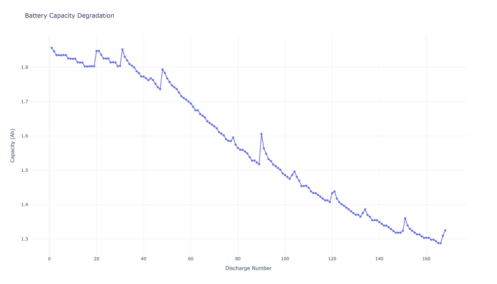
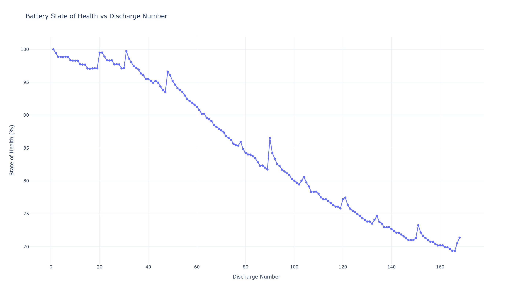
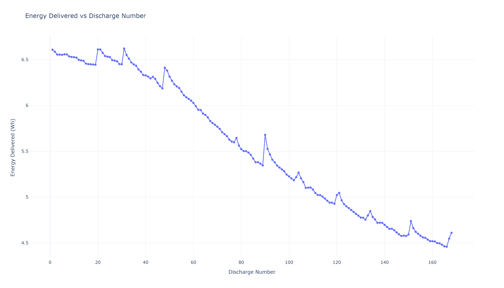
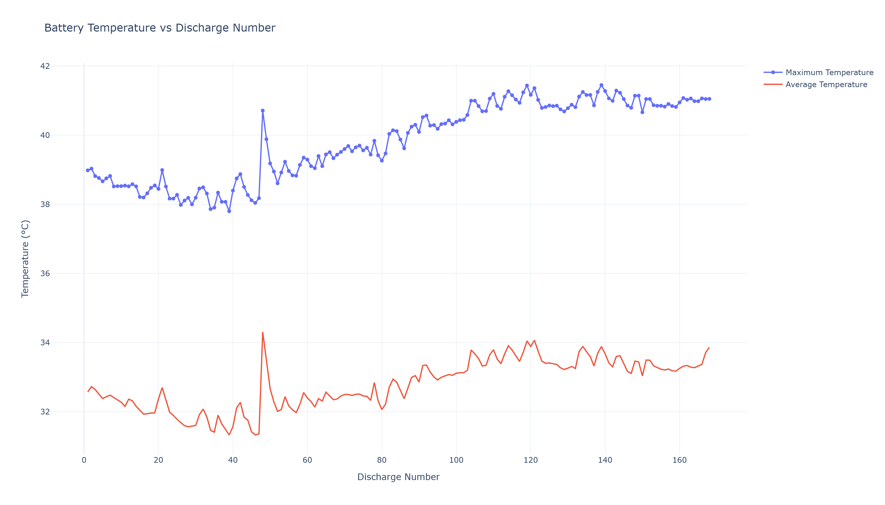

# 🔋 NASA Li-ion Battery Performance & Degradation Analysis

An interactive Python-based analysis of experimental lithium-ion battery data from NASA's battery aging dataset.

This project analyzes the charging and discharging behavior of a lithium-ion battery and investigates capacity degradation, State of Health (SOH), energy delivery, power characteristics, and thermal behavior over repeated discharge operations.

The project also includes an interactive Streamlit dashboard for exploring the battery data.

---

## 📌 Project Overview

Battery performance gradually changes with usage, making capacity, energy delivery, power, and temperature important indicators for battery monitoring and energy-storage applications.

This project uses experimental battery data to investigate:

* Charging voltage, current, and temperature
* Discharging voltage, current, and temperature
* Discharge power
* Energy delivered during discharge
* Capacity degradation
* State of Health (SOH)
* Temperature behavior during discharge
* Battery performance over repeated discharge operations

The analysis is implemented in Python using Pandas, NumPy, Plotly, and Streamlit.

---

## 📊 Dataset

The project uses battery **B0005** from the NASA Ames Prognostics Center of Excellence Li-ion Battery Aging Dataset.

The dataset contains experimental measurements from charge, discharge, and impedance operations.

The raw NASA `.mat` file is not included in this repository. Please obtain the original dataset from NASA and place:

```text
B0005.mat
```

inside the:

```text
data/
```

folder.

---

## ⚙️ Technologies Used

* Python
* Pandas
* NumPy
* Plotly
* Streamlit
* SciPy
* MATLAB `.mat` data processing

---

## 🔬 Analysis Performed

### 1. Charging Analysis

The charging data are analyzed using:

* Voltage
* Current
* Temperature
* Charging time
* Charging power

### 2. Discharging Analysis

For each discharge operation, the project analyzes:

* Voltage
* Current
* Temperature
* Discharge power
* Discharge capacity
* Energy delivered

Discharge power is calculated from the measured voltage and the magnitude of discharge current.

### 3. Capacity Degradation

Battery capacity is tracked across discharge operations to observe changes in battery performance with use.

### 4. State of Health

State of Health is calculated relative to the initial measured discharge capacity.

```text
SOH (%) = Capacity of discharge / Initial capacity × 100
```

### 5. Energy Delivered

Energy delivered during discharge is estimated by numerically integrating discharge power over time.

The result is reported in Wh.

### 6. Thermal Behavior

Maximum, minimum, and average battery temperature are analyzed for each discharge operation.

---

## 📈 Key Results

For the first recorded discharge operation:

* Discharge capacity: approximately **1.856 Ah**
* Maximum discharge temperature: approximately **38.98 °C**

Across the dataset, the measured discharge capacity decreases overall, indicating degradation of the battery's available capacity with repeated use.

The final recorded discharge capacity is approximately **1.325 Ah**, corresponding to an SOH of approximately **71.4%** relative to the initial discharge capacity.

---

## 📊 Generated Results

The analysis generates several figures showing battery degradation, energy delivery, and thermal behavior.

### Capacity Degradation



### State of Health



### Energy Delivered



### Temperature Behavior



## 🖥️ Interactive Dashboard

The project includes an interactive Streamlit dashboard that allows users to select individual discharge and charge operations and explore the corresponding measurements.

Dashboard features include:

* Charging analysis
* Discharging analysis
* Capacity and SOH
* Energy delivered
* Power analysis
* Temperature analysis
* Battery degradation plots
* Downloadable analysis results

### Run the dashboard locally

Clone the repository:

```bash
git clone YOUR_GITHUB_REPOSITORY_URL
```

Move into the project directory:

```bash
cd lithium-ion-battery-performance-analysis
```

Install the required packages:

```bash
pip install -r requirements.txt
```

Place the NASA `B0005.mat` dataset inside:

```text
data/
```

Then run:

```bash
streamlit run dashboard/app.py
```

The dashboard will open in your browser.

---

## 📁 Project Structure

```text
lithium-ion-battery-performance-analysis/
│
├── data/
│   └── README.md
│
├── dashboard/
│   └── app.py
│
├── src/
│   ├── __init__.py
│   └── battery_analysis.py
│
├── results/
│   ├── capacity_degradation.png
│   ├── soh_vs_discharge.png
│   ├── energy_vs_discharge.png
│   └── temperature_vs_discharge.png
│
├── notebooks/
│
├── README.md
├── requirements.txt
└── .gitignore
```

---

## 🎯 Relevance to Energy Storage

This project provides practical experience in lithium-ion battery data analysis and degradation assessment, with applications in:

* Battery Energy Storage Systems (BESS)
* Renewable energy integration
* Solar PV + battery systems
* Battery monitoring
* Energy management systems
* Battery health assessment

---

## 🚀 Future Improvements

Potential extensions include:

* Coulomb-counting based State of Charge (SOC)
* Internal resistance analysis
* Impedance-based degradation analysis
* Remaining Useful Life (RUL) prediction
* Machine-learning based SOH prediction
* Battery thermal modeling
* Battery performance comparison
* Integration with renewable-energy/BESS datasets

---

## 📚 Dataset Reference

Data source:

NASA Ames Prognostics Center of Excellence Li-ion Battery Aging Dataset.

The dataset should be obtained from the original NASA repository and used according to its applicable terms.

---

## 👩‍💻 Author

**Er. Soniya Karki**

Electrical Engineer | Renewable Energy  


